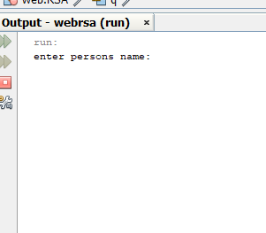
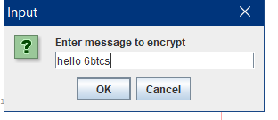
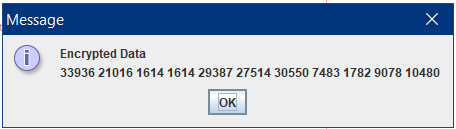
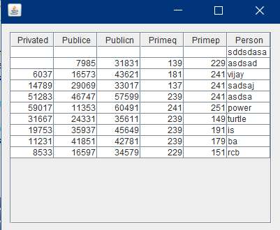

# RSA-ALGORITHM
Fully transparent working of RSA algorithm, which is enables individual to understand its working through its interactive GUI.
The application is also connected to MySql database through JPA controller class to retrieve the keys to decrypt the Cipher Text. 

DATABASE NAME : rsadb

Table name: Rsadb

Sample output:

